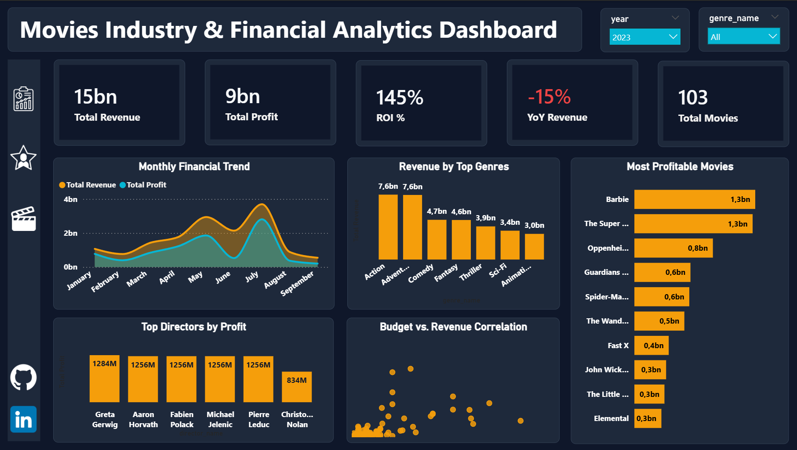
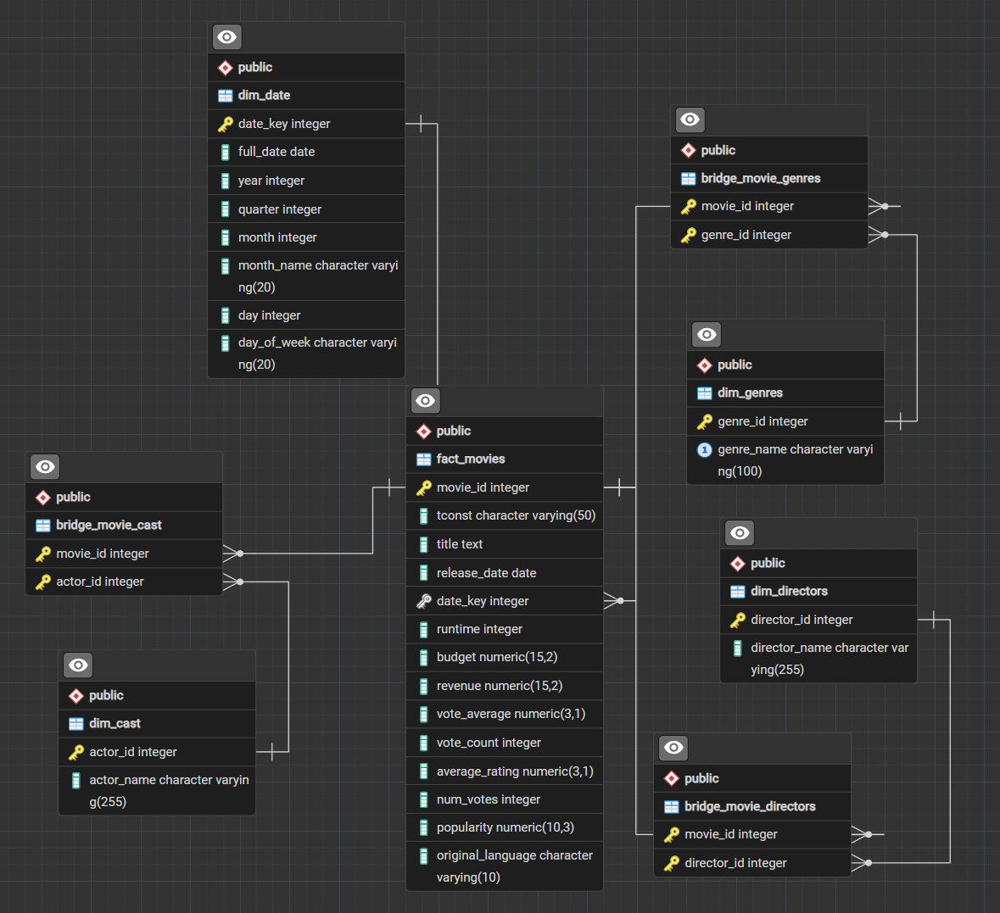
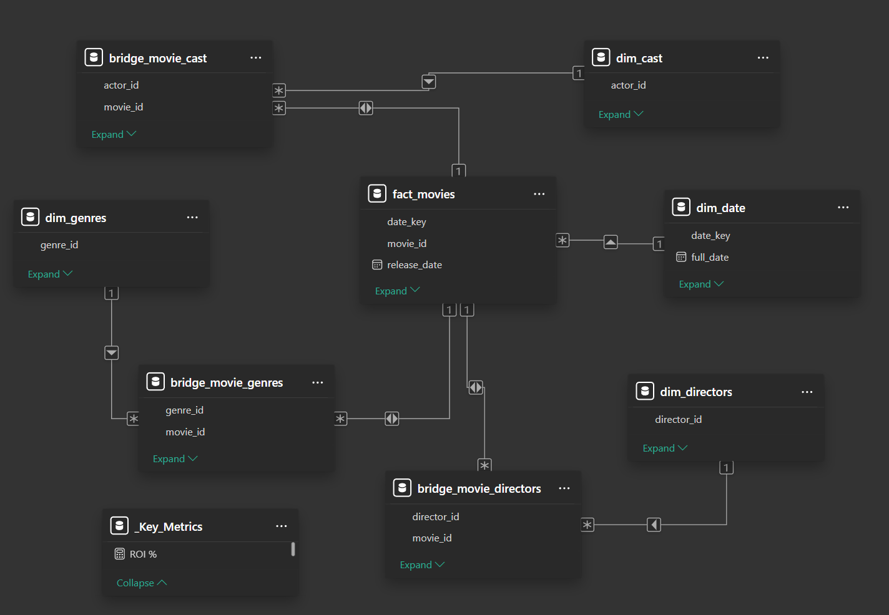
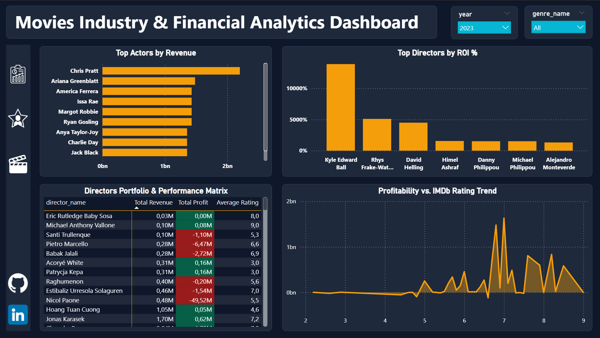
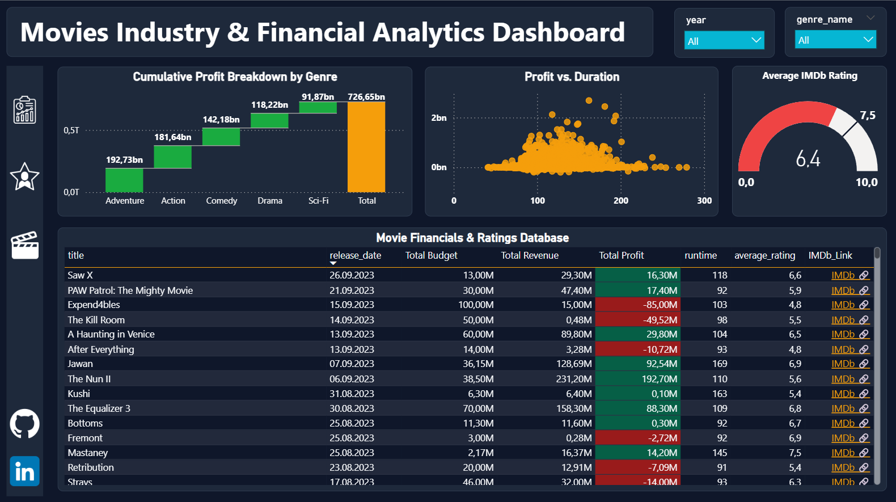

# 🎬 100 Years of Cinema: Movies Industry & Financial Analytics (1923–2023)


<div align="center">
  
</div>

## 📌 Executive Summary
This repository contains an end-to-end data analytics pipeline and interactive dashboard evaluating a full century of cinema history (**1923–2023**). The project extracts, cleans, and models data for over 9,000 movies to uncover actionable business insights regarding financial health, ROI efficiency, seasonality, and the box office impact of cast and crew. 

By leveraging **Python** for ETL, **PostgreSQL** for Data Warehousing, and **Power BI** for advanced visualization and DAX modeling, this project serves as a comprehensive demonstration of full-stack data analytics capabilities.

---

## 🔄 End-to-End Data Pipeline (ETL)
The project architecture strictly follows industry-standard ETL processes:

1. **Extraction & Transformation (Python & Pandas):** 
   - Extracted raw movie datasets using custom Python scripts (`scripts/movies_etl_pipeline.py`).
   - Cleaned messy currency strings, handled null values, and applied strict runtime/budget filters.
   - Parsed complex JSON arrays to extract nested attributes (genres, main cast, directors).
   - Normalized the flat dataset into a **3NF Relational Data Model**, exporting **8 clean CSV files**.
2. **Database Loading (PostgreSQL):** 
   - Engineered DDL schemas (`sql/01_schema_ddl.sql`) to import the CSVs into a relational PostgreSQL database.
   - Applied advanced SQL cleaning logic (`sql/02_data_cleaning.sql`) to remove micro-budget anomalies (< $10,000) and strict boundary enforcement for the 1923–2023 timeframe.
3. **Analytics & Visualization (Power BI):** 
   - Connected Power BI directly to the PostgreSQL instance.
   - Built a highly optimized **Star Schema** with robust Time Intelligence and custom DAX formatting.

---

## 📐 Database Schema & Data Modeling
The underlying data architecture bridges a highly normalized SQL backend with a highly denormalized analytical Star Schema frontend to support complex many-to-many relationships (e.g., one movie having multiple actors and genres).

| PostgreSQL Relational Database (3NF) | Power BI Analytical Model (Star Schema) |
| :---: | :---: |
|  |  |

---

## 💡 Advanced SQL Analytics & Key Business Insights
Extensive exploratory data analysis was conducted using complex SQL queries (Window Functions, CTEs, Aggregations) inside pgAdmin 4. Key commercial insights include:

* ☀️ **The "Summer Blockbuster" Seasonality Pattern:** 
  May, June, and July yield the highest average ROI (**211% – 235%**) and average revenue per movie ($93M – $107M). Conversely, August and September show the lowest average profitability, indicating strong seasonal shifts in consumer behavior.
* 🎭 **Genre Efficiency & Margin Analysis:** 
  While **Action** ($284.9B) and **Adventure** ($283.4B) dominate absolute volume, the **Animation** genre achieves the absolute highest profit margin (**70.11%**), followed closely by **Horror** (**67.25%**).
* ⭐ **Franchise Star Power:** 
  Lead actors consistently associated with major franchises (e.g., *Daisy Ridley, Rupert Grint, Daniel Radcliffe, Emma Watson*) maintain an overwhelming average of **$570M+ box office revenue per film**.
* 📈 **Extreme Director ROI Outliers:** 
  Pioneering classic animation directors (e.g., *Samuel Armstrong, Bill Roberts*) achieve phenomenal ROI values exceeding **6,000% – 8,000%** due to historically low production budgets generating massive, long-tail re-release revenues.

*(Note: The full suite of analytical queries used to generate these insights is available in `sql/03_business_analytics.sql`)*

---

## 🎬 Strategic Recommendations for Studio Executives & Producers

* **Optimize Release Windowing (The "Summer Strategy"):** Maximize capital efficiency by explicitly scheduling high-budget, tentpole releases for the May–July window. Shift mid-budget or high-risk projects away from the August–September "dead zone" to avoid historically proven suppressed box office returns.
* **Portfolio Reallocation (High-Margin Focus):** Reallocate a portion of the development budget away from saturated mid-tier Action/Adventure films into **Animation and Horror**. Horror, in particular, offers an asymmetric risk-reward ratio, generating top-tier profit margins (67.25%) with significantly lower upfront capital expenditure.
* **Establish a Micro-Budget "Incubator" Fund:** Capitalize on the extreme ROI outliers (e.g., *Skinamarink*, *The Blair Witch Project*) by dedicating 1-2% of the annual studio budget to an indie/experimental incubator. A single micro-budget viral hit yielding 400,000%+ ROI can easily absorb the losses of dozens of failed low-budget projects.
* **Franchise Casting as Risk Mitigation:** While talent acquisition costs are high, anchoring franchise films with historically proven lead actors (*Daisy Ridley, Daniel Radcliffe, etc.*) acts as a financial safety net, practically guaranteeing a baseline revenue floor of $500M+ per release. Long-term multi-picture contracts for franchise anchors remain highly viable financial instruments.

---
## 📊 Dashboard Architecture & Interactive Navigation
The Power BI report was designed with a premium, corporate "Dark Theme" UI/UX, utilizing an interactive **Bookmark & Selection Panel** to navigate seamlessly between three analytical views on a single page.

### 1️⃣ Executive Overview (Macro Analytics)
* **KPIs:** Total Revenue, Total Profit, ROI %, YoY Revenue Growth %, Total Movies.
* **Visuals:** Monthly Financial Trend Area Chart, Revenue by Top Genres, Most Profitable Movies, Budget vs. Revenue Scatter Plot.

### 2️⃣ Talent & Cast Analytics (Micro Analytics)
* **Visuals:** Top Actors by Revenue, Top Directors by ROI %, Profitability vs. IMDb Rating Trendline.
* **Matrix:** Director Portfolio Performance with conditional Red/Green heatmap formatting for instant profit/loss identification.

### 3️⃣ Movie Deep-Dive (Granular Analytics)
* **Visuals:** Cumulative Profit Breakdown by Genre (Waterfall Chart), Profit vs. Duration Scatter Plot.
* **Database:** Granular movie table featuring dynamic web URL icons (`🔗`) that route users directly to the specific movie's IMDb page.

<div align="center">
  
  
</div>

---

## 📂 Repository Structure
```text
movies-financial-analytics/
│
├── assets/                           # Dashboard screenshots and architecture diagrams
│   ├── overview.png
│   ├── talent_analytics.png
│   ├── movie_details.png
│   ├── postgres_erd.png
│   └── powerbi_data_model.png
│
├── data/                             # Data pipeline endpoints
│   ├── raw/                          # Initial unstructured datasets
│   └── processed/                    # 8 structured relational CSVs for DB import
│
├── scripts/                          # Python ETL
│   └── movies_etl_pipeline.py        # Cleans raw data and generates 3NF CSVs
│
├── sql/                              # PostgreSQL Backend
│   ├── 01_schema_ddl.sql             # Table creation and foreign key definitions
│   ├── 02_data_cleaning.sql          # Anomaly removal and strict date filtering
│   └── 03_business_analytics.sql     # Complex analytical queries (CTEs, Window Functions)
│
├── reports/                          # Power BI Frontend
│   └── Movies_Financial_Analytics_Dashboard.pbix
│
└── README.md                         # Project documentation

## ⚙️ How to Reproduce

1. Clone this repository to your local machine:

```bash
git clone https://github.com/your-username/movies-financial-analytics.git
```

---

## 🚀 Reproduction & Setup Guide

**1. Clone the Repository**

```bash
git clone https://github.com/YOUR_USERNAME/movies-financial-analytics.git
cd movies-financial-analytics
```

**2. Execute Python ETL Pipeline**

- Run `scripts/movies_etl_pipeline.py` to process the raw movie data.
- Ensure the processed `.csv` files are generated successfully.

**3. Setup PostgreSQL Database**

- Create a new PostgreSQL database.
- Execute `sql/01_schema_ddl.sql` to create the required database tables.
- Import the processed CSV files into the corresponding tables.
- Execute `sql/02_data_cleaning.sql` to clean and prepare the data for analysis.

**4. Launch Power BI Dashboard**

- Open `reports/Movies_Financial_Analytics_Dashboard.pbix` using Power BI Desktop.
- Go to **Transform Data → Data Source Settings**.
- Update the PostgreSQL server and credentials according to your local database configuration.
- Click **Refresh** to load the data into the dashboard.

---

## 👤 Author

**Nihat Rzaquluzade | Junior Data Analyst**

This project was developed as a professional **Data Analytics portfolio project**, demonstrating skills in Python, PostgreSQL, ETL processes, data cleaning, SQL analysis, and Power BI data visualization.

[](https://github.com/nihatrza)

[](https://www.linkedin.com/in/nihat-rzaquluzade-624b332a9/)

---

<div align="center">
